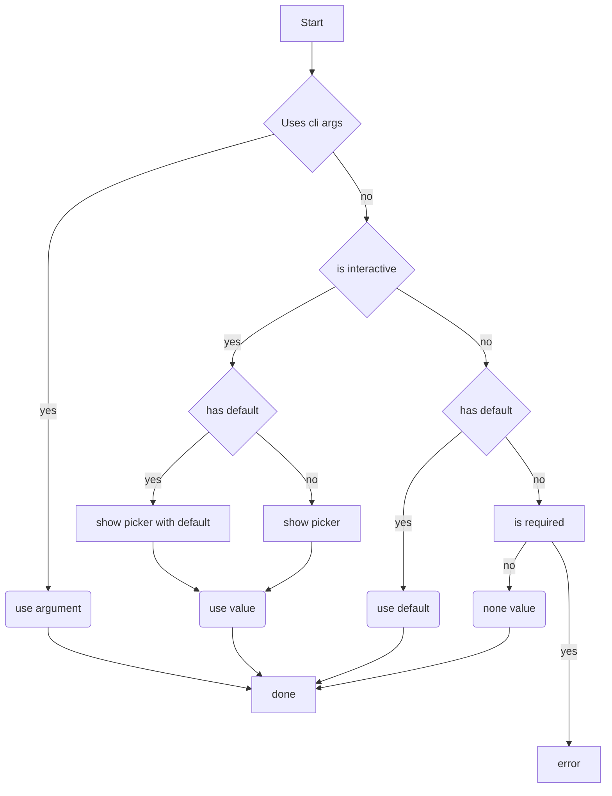

# Developer guide

This guide goes through some of the principle and guidelines that should be
taken into account when creating new commands or updating existing commands.
These principle and guidelines should result in a fp that is easy and pleasant
to use.

## Prefer simplicity

A command that does one thing and does it good, is better than a command that
does lots of things but is hard to understand. This also applies to arguments.
If a argument has lots of different usages it requires that the user carefully
reads the usage doc, but it better to separate this into separate arguments. By
utilizing mutual exclusive arguments in clap it is not possible to have the user
supply both.

Of course it is not possible to always adhere to this.

## Interactive usage

It is required that every command is be able to be executed by only using
the CLI's flag. This is to support scripting. It is also _highly_ recommended to
support interactive methods of getting the parameters. This can be a simple
text input or a select.

To accommodate arguments, defaults, required values, etc, look at the following
flow diagram to decide the flow to use:

### Interactive helpers

The [`interactive`](../src/interactive.rs) module contains a bunch of helper
functions which should implement the above flow for a few use-cases, such as
retrieving text or showing an interactive picker for selecting a notebook.
